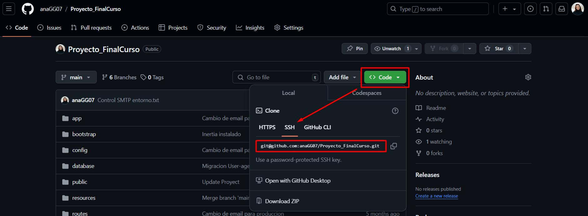

_Ana María García.  
Desarrollo de Aplicaciones Web_

---

# Guía de Comandos Básicos para Git

- [Guía de Comandos Básicos para Git](#guía-de-comandos-básicos-para-git)
  - [¿Qué es Git?](#qué-es-git)
  - [¿Qué es un control de versiones?](#qué-es-un-control-de-versiones)
  - [¿Qué es Git Flow?](#qué-es-git-flow)
  - [Primeros pasos, herramientas](#primeros-pasos-herramientas)
  - [SSH](#ssh)
    - [Para originar claves:](#para-originar-claves)
  - [Creación de un repositorio local](#creación-de-un-repositorio-local)
    - [Configuración:](#configuración)
  - [Aprobación de cambios en consola](#aprobación-de-cambios-en-consola)
  - [Ignorar archivos](#ignorar-archivos)
  - [Trabajo en remoto](#trabajo-en-remoto)
    - [Añadir repositorio remoto al repositorio local](#añadir-repositorio-remoto-al-repositorio-local)
  - [Subir cambios a remoto](#subir-cambios-a-remoto)
  - [Clonar un repositorio](#clonar-un-repositorio)
  - [Deshacer cambios](#deshacer-cambios)
  - [Actualizar cambios de remoto a local](#actualizar-cambios-de-remoto-a-local)
  - [Corrección de errores](#corrección-de-errores)
  - [Estrategia Merge](#estrategia-merge)
  - [Estrategia Rebase](#estrategia-rebase)
  - [GIT STASH](#git-stash)
  - [Otros comandos útiles](#otros-comandos-útiles)

## ¿Qué es Git?

Git es un sistema de control de versiones que permite ver un histórico detallado de los cambios que se van produciendo en el código. Facilita el trabajo en equipo de proyectos y permite una integración sencilla con plataformas de colaboración como GitHub y GitLab. También permite la ramificación, permitiendo trabajar de forma paralela sin afectar la rama principal.

## ¿Qué es un control de versiones?

Git toma instantáneas del trabajo que realizamos (commit). Cuando realizamos cambios sobre un fichero y tomamos una nueva instantánea, Git genera una referencia a los cambios que difieren entre la instantánea anterior y la nueva.

Git utiliza tres estados:

- **Modificado**: Cuando se realiza algún cambio en el archivo.
- **Preparado (Staged)**: Cuando los cambios han sido marcados para incluirse en la siguiente confirmación (`git add`).
- **Confirmado (Committed)**: Cuando se confirman los cambios (`git commit`).

## ¿Qué es Git Flow?

Git Flow es una metodología que organiza las ramas. Define una estructura clara con las siguientes ramas:

- **main**: Rama principal.
- **develop**: Dedicada al desarrollo.
- **feature**: Para añadir nuevas funcionalidades.
- **release**: Preparada para publicar cambios.
- **hotfix**: Trabaja directamente con `main` para crear parches críticos.

## Primeros pasos, herramientas

- [Git Download](https://git-scm.com/downloads)
- [SourceTree Download](https://www.sourcetreeapp.com/)
- [GitKraken Download](https://www.gitkraken.com/)
- [Cliente GitHub Desktop](https://github.com/apps/desktop)
- [KDIFF3 Download](https://sourceforge.net/projects/kdiff3/)

## SSH

SSH es un protocolo de red seguro que proporciona autenticación segura y comunicaciones cifradas. Utiliza un sistema de pares de claves (pública y privada).

### Para originar claves:

`ssh-keygen -t ed225519 -C "comentario"`

Solicitará el lugar de almacenamiento del archivo que se generará. Por defecto ya viene identificada una ruta, que será la que utilice de forma automática para buscar la clave. Si se le modifica el nombre, habrá que especificar que clave pública se quiere utilizar.

Una vez terminada la configuración, se han generado ambas claves. En este caso se encuentran en el directorio *.ssh*, identificadas por *id_ed25519* e *id_ed25519.pub*, siendo esta última la clave pública.

Se puede ver la clave pública con:

`cat id_ed25519.pub`

Luego, se añade la clave pública en GitHub en el apartado de `Settings -> SSH and GPG keys`.

Para verificar la conexión:

`ssh -T git@github.com`

Si aparece un error *“The authenticity of host 'github.com (140.82.121.4)' can't be established.”*

Es probable que sea la primera vez que se intenta una conexión a un servidor SSH o que durante la instalación no se creó el archivo *“known_hosts”*, que es el encargado de guardar las claves de los servidores a los que se conecta para verificar su identidad en conexiones futuras.

Se puede solucionar con:

`ssh-keyscan github.com >> ~/.ssh/known_hosts`

**El beneficio de utilizar el sistema de identificación por SSH, es la posibilidad de autenticarse sin necesidad de usuario y contraseña. Y esto se debe a que el sistema buscará las claves públicas y privadas almacenadas en local, enviándolas al servidor de GitHub, donde, con los pasos anteriores, se ha añadido la clave pública.**

## Creación de un repositorio local

Para crear un repositorio local, abrir la terminal en la carpeta deseada y ejecutar:

`git init`

Esto generará un repositorio vacío con la rama principal llamada `main`.

Tras ejecutar este comando, se genera entre otros, un archivo llamado `.git` que contiene la información del repositorio, la configuración, etc. **Es importante no borrar este archivo.**

### Configuración:

`git config ` --> almacena opciones globales que siempre se van a utilizar, como nombre de usuario, correo electrónico etc. Estas son las credenciales con las que se van a firmar todos los commits que se realicen.

`git config --global user.name "nombreUsuario"` --> Ejemplo de modificación de globales, donde se cambia el nombre de usuario con el que se firmarán los commits.

## Aprobación de cambios en consola

- `git status`: Se accede al *“Working area”*, mostrando qué ficheros han sido modificados y que no están incluidos en el *“stage area”*.
- `git add archivo1...archivoN`: Se añaden al *“stage area”* los ficheros incluidos en el comando.
- `git commit -m "mensaje descriptivo"`: Añade TODOS los ficheros al *“stage area”*, sin ningún tipo de filtrado.

Tras añadir los ficheros al *“stage area”*, si se realiza de nuevo el comando *git status*, todos los archivos añadidos cambiarán de color, indicando que están en seguimiento y listos para ser *“commiteados”*.

`git commit -m “comentario descriptivo”` --> Realiza una “instantánea” del estado actual de los ficheros.

**De nuevo, si se realiza un git status, todos los archivos en seguimiento ya no se encuentran disponibles.**

## Ignorar archivos

Todos los archivos que no se quieren subir al repositorio, se almacenan en un archivo llamado ***.gitignore***. Este archivo interpreta expresiones regulares, por lo que se debe especificar que contenido exactamente se quiere ignorar.

`*.pdf` --> Ignora todos los archivos PDF.

`.gitIgnore_global` --> Este archivo se encuentra en la carpeta usuario y es común en todos los repositorios.

 `git log `--> Permite comprobar un historial de *“commits”* o instantáneas, identificados por un código hash, el autor y la fecha. Esta identificación va a permitir volver, borrar, actualizar un commit antiguo.

## Trabajo en remoto

Crear un repositorio desde GitHub o GitLab es bastante intuitivo. Siguiendo las indicaciones, se establece el nombre del proyecto, el estado privado/público e incluir un archivo README como configuración básica. 

El problema viene cuando ya se ha creado un repositorio local y se quiere enlazar al remoto. Dado que ya se han generado ciertos archivos como por ejemplo un README, si en la configuración del remoto, se establece que se genere este archivo de nuevo, en el momento de subir los cambios de
local a remoto se encontrarán incidencias. Para evitar esto, es mejor no incluir este archivo a la hora de crear el repositorio en remoto porque se subirá el que se

### Añadir repositorio remoto al repositorio local

git remote add *“nombre”* *“ruta al repositorio”* --> *“nombre”* es el nombre de la ruta remota, que por defecto suele ser *“origin”* si solo se trabaja con un repositorio remoto. Si por el contrario se trabaja con gitLab también por ejemplo, *“nombre”* podría ser *“gitLab”*.

La ruta al repositorio va a ser de una manera u otra dependiendo de si se usa SSH o HTTPS. Una ruta de SSH puede verse así:

`git@github.com:Usuario/NombreProyecto.git`

Esto va a permitir añadir una ruta de repositorio remoto a un repositorio local.

## Subir cambios a remoto

`git push --set-upstream origin main` --> Si no se indica a que rama se subirán los cambios, ofrecerá la posibilidad de enlazar las ramas principales, es decir “origin” que es el nombre que se le ha puesto a la rama remoto y “main” que es la rama local.

Establecer un ***"upstream"*** es especialmente útil cuando se colabora con otros desarrolladores. Permite estar sincronizado con la rama remota y recibir los cambios de otros compañeros con comandos simples como git pull.

Si no se tiene un ***"upstream"*** establecido, Git pedirá que se especifique siempre la rama remota cuando se quiera hacer push o pull.

`git push` --> Una vez enlazado remoto-local, basta con utilizar este comando para subir los cambios a remoto. Es importante tener en cuenta que tras hacer un commit se debe realizar un git push, de lo contrario los cambios no serán actualizados en remoto. 

## Clonar un repositorio

Para clonar un repositorio se debe acceder a la ruta del mismo en remoto. Ésta se encuentra en la pagina principal del repositorio y se puede utilizar cualquiera de las opciones. La más recomendable es SSH por su seguridad.

`git clone git@github.com:usuario/nombreProyecto.git` --> comando para clonar repositorios mediante SSH.

## Deshacer cambios

Se pueden deshacer cambios en cualquiera de las 3 áreas (working, stage y committed).

**Working** --> Si se ha realizado un cambio y se quiere volver atrás, se puede utilizar el comando:

`git checkout “nombre del fichero modificado”` --> Vuelve al punto “head”, es decir, los cambios más recientes que estan guardados en commit.

**Stage** --> Si los cambios ya estan en seguimiento (git add):

`git restore --staged “nombre fichero”` 

`git reset HEAD “nombre del archivo”` --> Devuelve el/los archivo/s a el working area”. Esto se puede enlazar con un ***git checkout “nombre del fichero”*** 

**Committed** --> Si ya se ha realizado un commit, se debe utilizar de nuevo un reset, pero se divide en tres opciones:

- ***Tipo soft*** -> los cambios se eliminan pero vuelven al stage area. 
  
  -  `git reset --soft HEAD~1`
- ***Tipo mixed*** -> los cambios se mantienen en el working area, es el que se utiliza por defecto. 
  -  `git reset --mixed <commit>`
- ***Tipo hard*** -> no deja rastro de cambios. 
  - `git reset --hard HEAD~1`
  - `git revert “elemento”`: Operación menos destructiva. En este caso, “elemento” puede tomar el valor de HEAD, deshará el último cambio. Si se pone ~1, desharía el penúltimo cambio. Si se pone el hash del commit, elimina el commit por completo.
  
En todo momento, se crea un nuevo commit avisando de estos cambios. 
  
## Actualizar cambios de remoto a local
`git fetch` --> Comprueba si existen cambios en remoto.

`git pull` --> descarga todos los cambios que hay pendientes. 

## Corrección de errores

`git diff` --> Muestra las diferencias de cambios entre el area de trabajo y otro punto (este punto es importante antes de hacer un commit, justo después de un add)

`git blame “fichero a examinar”` --> Comando pensado para encontrar el “culpable” de la edición de un fichero o la escritura de una línea de código por ejemplo. 

## Estrategia Merge

Merge se emplea para unir una o mas ramas hacia la rama principal. Para realizarlo, hay que ubicarse en la rama a la que se le quieren aplicar las modificaciones, que suele ser la principal. 

`git merge “nombre de la rama a traer”` --> Por defecto aplica la estrategia ***Fast-forward*** o “avance rápido”. Con esta estrategia, la rama será totalmente lineal sin mostrar las bifurcaciones habituales que surgen al crear y “mergear” nuevas ramas.

`git merge --no-ff “nombre de la rama a traer”` --> De esta manera se indica que no se siga la estrategia ***Fast-forward***. 

## Estrategia Rebase

Esta estrategia, busca unir diferentes ramas pero reescribiendo la historia de una o varias ramas. Suele ser bastante similar a realizar un merge con fast-forward.

Situado en la rama a la que se le quieren añadir los cambios (habitualmente la rama principal), se ejecutaría el comando:

`git rebase “nombre de la rama a traer”` 

## GIT STASH
Si se tienen cambios en la rama actual y se necesita cambiar a otra rama, lo habitual es guardar los cambios y subirlos a remoto para poder cambiar de rama sin tener conflictos. Pero no siempre se quiere guardar los cambios actuales porque aún no esten terminados o por cualquier otro motivo.

Git Stash es un “cajón” que permite almacenar todos los cambios sin subirlos a remoto, permitiendo el cambio entre ramas sin crear ningún conflicto.

`git stash` --> almacena todos los cambios en el “cajón”.

`git stash apply` --> saca del “cajón” los cambios guardados.

`git stash list` --> muestra todas las entradas almacenadas en el “cajón”

`git stash pop` --> saca el último conjunto de cambios guardados en el stash y lo aplica al área de trabajo, elimando esa entrada del stash. 

## Otros comandos útiles

`git branch -a `--> Lista todas las ramas, locales o remotas

`git branch “nombre”` --> Crea una nueva rama.

`git checkout “nombre rama/etiqueta/id_commit”` --> Se cambia al lugar pecificado.

`git checkout -b “nombre”`--> Crea una nueva rama y se cambia a ella.

`git show` --> Muestra lo que se modificó de un commit a otro. 7

`git reflog` --> Muestra un historial de operaciones recientes. Incluyendo commits que ya no están en las ramas activas. Permite recuperar commits perdidos.

`git pull --rebase` --> Trae los cambios del repositorio remoto y los aplica en los locales reescribiendo la historia en lugar de generar un merge commit

`git diff “rama1” “rama2”` --> Compara dos ramas y muestra las diferencias entre ellas.

`git tag` --> Lista o crea etiquetas que marcan puntos específicos en el historial. Útil para versionado.