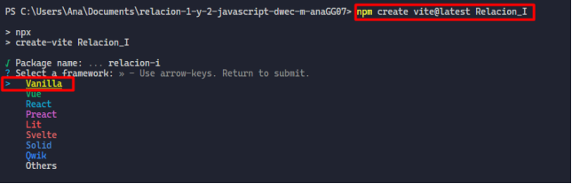
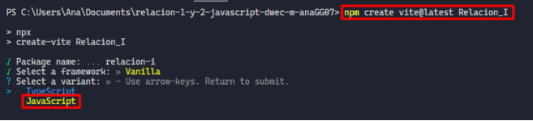
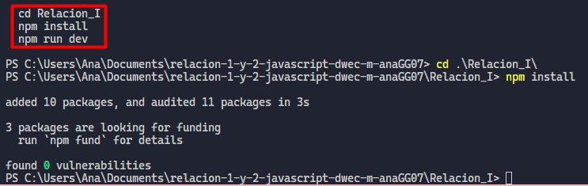

_Ana María García.  
Desarrollo de Aplicaciones Web_

---

# Guía Básica para Vite, Node.js

## ¿Qué es Vite?

Vite es una herramienta moderna de desarrollo frontend, creada para mejorar el rendimiento y la experiencia de desarrollo. Su nombre significa "rápido", lo cual refleja su enfoque en la velocidad y eficiencia. Ofrece un servidor de desarrollo ultra rápido y una construcción de producción optimizada. Usa módulos ES (ECMAScript) nativos del navegador durante el desarrollo, evitando la necesidad de empaquetar todos los archivos, acelerando el inicio de proyectos.

## Beneficios de Vite

- **Rápido arranque**: Al no empaquetar todos los módulos al inicio, permite un arranque casi instantáneo.
- **Hot Module Replacement**: Permite ver cambios inmediatos en el navegador sin recargar toda la página.
- **Soporte para varios frameworks**: Vite es compatible con Vue, React, Preact... entre otros.

## Proceso de instalación

De forma previa se debe tener instalado Node.js. Se puede conocer el estado y versión de Node con el comando:

`node -v`

Para crear un nuevo proyecto de Vite se puede realizar con el siguiente comando, que descargará la última versión disponible:

`npm create vite@latest "nombre de proyecto"`

En el proceso de instalación aparecen distintas opciones de configuración. En primer lugar se elige el framework a usar. En este caso, Vanilla JavaScript (JavaScript puro) es ideal para proyectos pequeños o para evitar la complejidad de otros frameworks.

Después solicita la elección de una variante, donde se puede elegir entre JavaScript o TypeScript. JavaScript utiliza el estándar más común que no requiere tipos estrictos, de esta forma se simplifica el código si no se necesitan demasiadas validaciones de tipo.

## Instalar dependencias

Una vez creado el proyecto, se deben instalar las dependencias con los siguientes comandos:

`npm install`

Este comando instala todas las dependencias necesarias que estarán definidas en el archivo `package.json` generado por Vite. Incluye herramientas y librerías necesarias.

`npm run dev`

Este comando ejecuta el servidor de desarrollo de Vite. Inicia un servidor local, que sirve para mostrar la aplicación web en el navegador con el puerto `:5173`.

En este punto, ya tendríamos Vite instalado.

## Tailwind CSS

Tailwind CSS es un framework de utilidades que permite aplicar clases directamente en los elementos HTML para darles estilo.

### Instalación

Para iniciar Tailwind CSS en el proyecto, se ejecuta el siguiente comando:

`npx tailwindcss init -p`

Npx es una herramienta que permite ejecutar paquetes de npm sin necesidad de instalarlos de forma global. El comando anterior, generará los archivos:

- `tailwind.config.js`: archivo de configuración donde se define qué archivos del proyecto deberían incluir las clases de Tailwind. Es importante incluir el archivo `index.html`.
- `postcss.config.js`: archivo de configuración de PostCSS, que es el procesador que permite transformar el código CSS con plugins.

## Estructura del Proyecto

La estructura típica de un proyecto de Vite y Tailwind puede verse así:

- **node_modules/**: Esta carpeta contiene todos los módulos instalados a través de npm, incluidas las dependencias de Vite y Tailwind CSS.
- **public/**: Aquí se colocan archivos estáticos como imágenes, fuentes u otros recursos que no cambian durante el desarrollo.
- **src/**: Contiene los archivos fuente del proyecto.
  - **data/**: Puede almacenar archivos de datos (por ejemplo, archivos JSON) que podrían ser útiles para el proyecto.
  - **helpers/**: Scripts auxiliares de JavaScript.
  - **styles/**: Archivos CSS personalizados.
  - **main.js**: El archivo principal de JavaScript donde se puede escribir la lógica de la aplicación.
- **index.html**: El archivo HTML principal que se sirve al usuario. Es donde se carga el JavaScript y los estilos del proyecto.
- **package.json**: Un archivo que contiene la lista de dependencias, scripts y metadatos del proyecto.

## ¿Por qué esta estructura?

Vite sigue una estructura de proyecto estándar que hace que sea fácil organizar los archivos. La carpeta `src` está destinada a contener todo el código fuente, mientras que `public` se utiliza para archivos estáticos que no requieren procesamiento especial. Este diseño modular permite mantener el código organizado y escalable.
